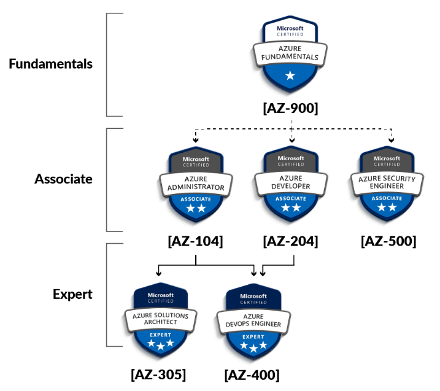
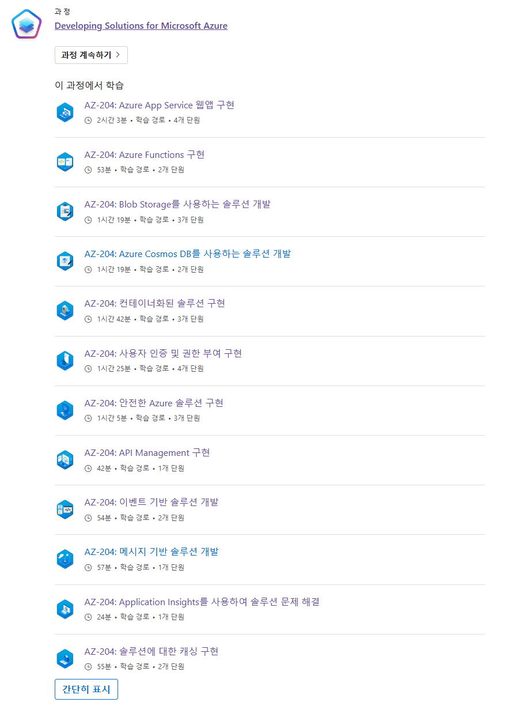
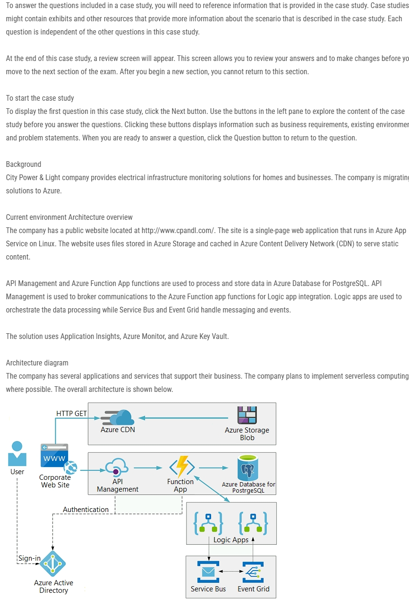
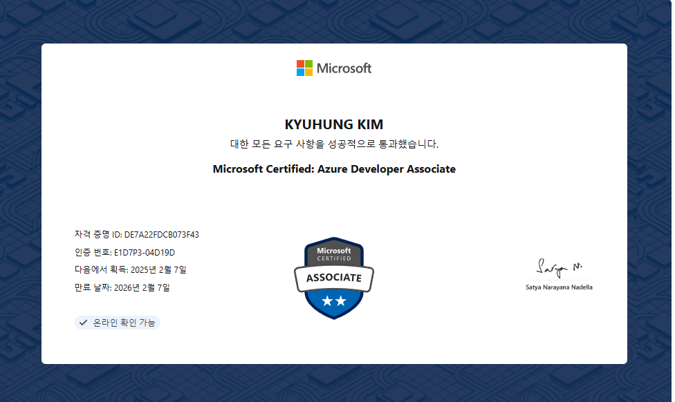

## 개요

> *Docker/Kubernetes 하나 모르는데 Azure Migration 프로젝트를 하라고요?*
> 

분명 나는 Java/Web 개발자로 입사를 했는데 팀에 배속되자 AKS-자습서 ([AKS 어플리케이션만들기]([https://learn.microsoft.com/ko-kr/azure/aks/tutorial-kubernetes-prepare-app?tabs=azure-cli](https://learn.microsoft.com/ko-kr/azure/aks/tutorial-kubernetes-prepare-app?tabs=azure-cli)))와 *처음 시작하는 애저* 책을 가지고 Azure 공부를 하라고 하셨다.

우선 단순히 명령어를 따라하고 리소스를 만들면서 엉성한 공부를 하였고, 내가 투입된 업무는 KT Cloud(AS-IS)에서 운영되고 있던 Container 기반의 KT 외국인샵을 Azure 환경(TO-BE)로 Migration하는 업무였다.

> [KT 외국인샵](https://globalshop.kt.com/global/globalMain.do)

어찌 어찌 지원팀과 능력자들의 도움을 받아 프로젝트를 완료하였지만, 막상 내 머리에 남는 것은 거의 없었다. 

이럴 때 시험 공부 같은 이론 공부를 통해 머릿속에 정리를 하는 시간을 가지고 싶었고, 곧바로 `AZ-900` 을 응시했는데 시험이 너무 쉬운 관계로 더 높은 등급에 대한 욕구가 생겼다.

*Fundamentals* 등급인 `AZ-900` 을 따고 *Associate* 등급의 `AZ-104` (운영자)와 `AZ-204` (개발자) 사이에서 고민을 했다. 실제 내가 하는 업무에는 `AZ-104`가 더 가깝지만… 개발자로써 살아가고 싶은 욕구와 `AZ-204` 자격증을 보유한다면 개발 업무도 맡을 수 있지 않을까 싶어 `AZ-204` 등급을 목표로 하기로 하였다.

## AZ 204 시험이란?

_Azure 자격증 코스_

`AZ204` 는 **Associate**등급의 Azure의 개발 관련 지식을 테스트하는 시험이다. 

단순 개발 지식뿐만 아닌 간단한 설계와 그에 따른 보안, 권한, 성능, 모니터링을 포함하는 전체 과정에 대한 테스트로 이론 문제 뿐만 아닌 Code와 관련된 문제, 적절한 구현 순서 등을 묻는 문제 또한 자주 출제 된다. 
전체적인 시험 유형은 48 ~ 56문제로 **사례 연구**(Archtiect 제공 후 여러 꼬리 문제 해결), **4지 선다**, **Drop Down**, **연속 문제**(하나의 Case에 대해 유효성 평가)로 이루어진다.

자세한 범위는 아래와 같다. 

  
📌 자세한 범위

    - Azure 컴퓨팅 솔루션 개발(25~30%)  
    - Azure 스토리지 개발(15~20%)  
    - Azure 보안 구현(15–20%)  
    - Azure 솔루션 모니터링, 문제 해결 및 최적화(10–15%)  
    - Azure 서비스 및 타사 서비스에 연결 및 사용(20–25%)   

 

## 공부법

> [과정 AZ-204T00-A: Microsoft Azure용 솔루션 개발 - Training](https://learn.microsoft.com/ko-kr/training/courses/az-204t00)

MS Learn 사이트를 적극 활용했다. AZ204 Tranining 순서대로 공식 문서를 기반으로 공부를 하였다.

Azure 무료 크레딧이 있다면 실습을 하면 큰 도움이 될 듯 하다.

_AZ-240 MS Learn_

하지만 위 범위 한정에서 나오는 것이 아닌, 해당 범위와 관련된 모든 기술 문서가 범위임으로 해당 과정으로 모든 준비를 할 수는 없다.

정리하자면 `AZ-204` 과정(반드시 알아야 할 지식)을 미리 정리하며 기본 지식과 용어를 익히고, 덤프를 풀이하며 부족한 개념이 나온다면, 관련된 MS Learn을 찾아가 학습해 지식에 살을 붙이는 식으로 진행하였다. 

또한 Azure 시험은 시험 중 MS Learn 사이트 접속이 가능한데, 공부 할 당시에 관련 개념은 MS Learn 사이트에서 찾아서 학습한다면, 실제 응시 중 헷갈리는 항목에 대해서 다시 MS Learn을 찾아가 도움을 얻을 수 있다. 

### Dump 페이지

덤프에 대해서는 [Examtopics]([https://www.examtopics.com/exams/microsoft/az-204/](https://www.examtopics.com/exams/microsoft/az-204/))에 100문제 무료가 존재하며, [BrainDumps]([https://free-braindumps.com/microsoft/free-az-204-braindumps.html](https://free-braindumps.com/microsoft/free-az-204-braindumps.html))에서 무료로 *안전한 Azure 솔루션*, *사용자 인증 및 권한 부여* 항목에 대해서는 모든 덤프에 접근할 수 있다. 

또한 **사례 연구** 항목은 아래와 같이 나오는데 실제 시험에서 처음 보게 된다면… 상당히 길고 당황스럽다…

Github, Reddit 그리고 덤프 사이트를 뒤지다 보면 사례 연구를 찾게 되는데 미리 읽어보고 예상 문제나 관련 지식을 미리 공부한다면 큰 도움이 될 것 같다.

_사레 연구 예시(전기 인프라 모니터링 솔루선 구축)_

## 결과

첫 1회 시험에서 MS Learn 기반 학습과 Dump 무료 100문제를 풀고 응시를 했다가. `585점`를 받고 불합격 하였다.(*50달러 증발)* 

그 뒤 사례 연구에 대한 학습과 추가 Dump 풀이 그리고 그에 따른 개념 학습을 통해 공부를 하고
두 번째 시험에서 `795점`이라는 점수로 합격할 수 가 있었다. 

_자격 발급_

간단하게 지식 정리할려고 응시할려 했지만 생각보다(?) 어려워 당황했다. 추후 기회가 된다면 *Expert* 등급인 `AZ-400` 을 응시 하도록 하고, 우선은 `CKA` 자격증과 알고리즘 풀이를 병행해볼려고 한다. 

안녕 MS Learn~