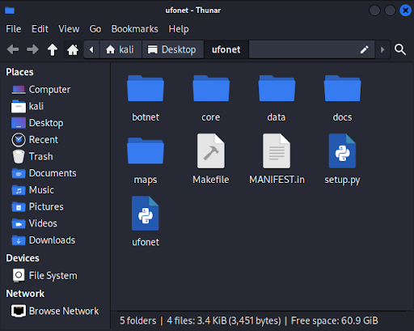

## DDOS 툴 사용

- DDos 실습을 진행하고 대부분의 실습이 dos로 이루어졌다는 아쉬움
- 실제 DDos툴이 있다는것을 알게되어서 가볍게 추가 실습을 진행하였다.

**1. ufonet 설치**

  >git : https://github.com/epsylon/ufonet

   

**2. 좀비 찾기**

- 서치 엔진을 활용하여 yahoo!의 좀비 pc를 찾는다

- “Checking for payloads” 섹션에서 OK :1 이라 되있기에 적어도 하나의 페이로드가 실행 가능한 상태임을 알 수 있다.

- 현재 웹페이지가 공격 가능하다.

**3. 좀비 다운로드**

  - 좀비 PC를 다운로드하였다.
  - 실제 공격이 가능하다고 하지만 이 이상의 실습은 실제 불법행위로 이어질수 있다고 판단하여 중단했다.
 

---

### 고찰

- 이론 공부 보다는 이런 실습이 재밌는거 같다.
- 그런데 이론 제대로 안하고 생각없이 실습하다가는 쇠고랑 찰거 같다.
  
